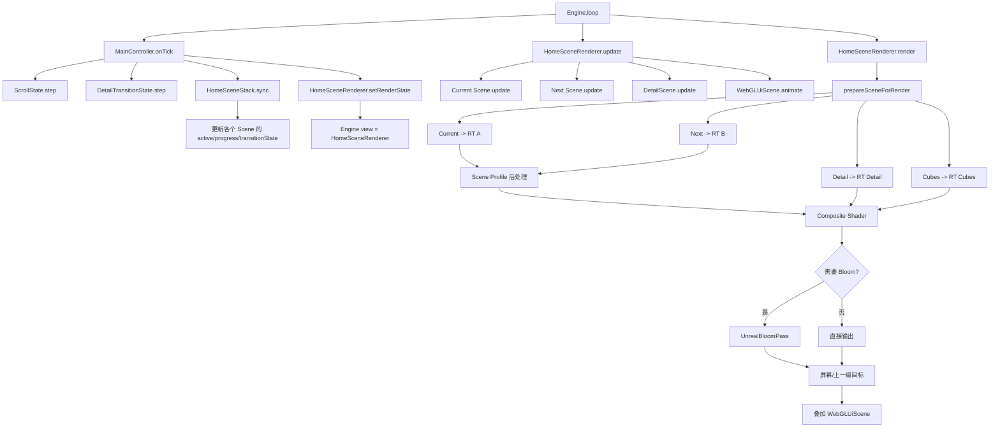
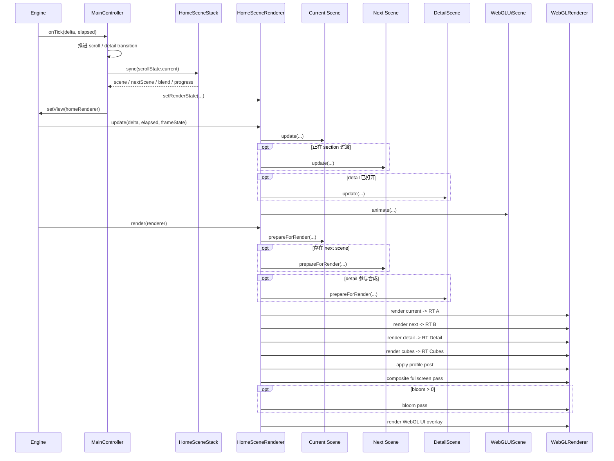
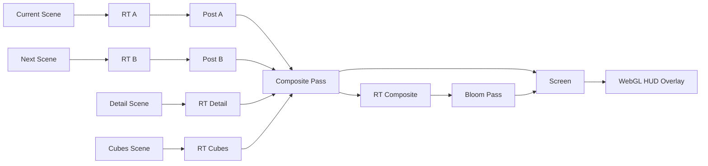
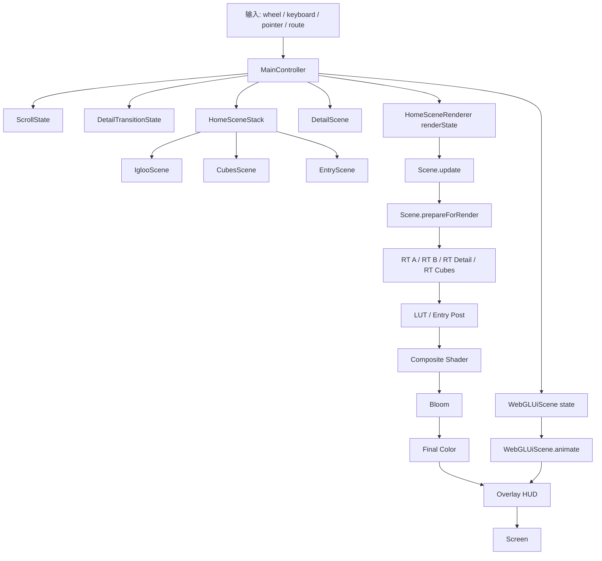

# 渲染管线详解

## 1. 文档目的

这份文档专门回答一个问题：

这个工程里的 Three.js 画面，究竟是怎样从 runtime 状态一路变成最终屏幕图像的。

它重点覆盖：

- 每帧的调用顺序
- `Engine`、`MainController`、`HomeSceneStack`、`HomeSceneRenderer` 的职责分工
- 各个离屏 `RenderTarget` 的用途
- scene 在正式渲染前做了哪些预处理
- `LUT`、`entry post`、`composite`、`bloom`、`WebGL HUD` 分别在什么阶段介入
- 首页 scene 与 detail overlay 是怎样合成到同一张最终画面上的

这份文档不讨论：

- 单个 scene 内部所有 shader 的逐行实现
- 资源美术来源
- DOM HUD 的结构细节

如果你想先看运行时总览，再看本文，推荐先读：

- [01-system-overview.md](./01-system-overview.md)
- [02-runtime-flow.md](./02-runtime-flow.md)
- [04-scenes-overview.md](./04-scenes-overview.md)

## 2. 一句话结论

这个工程不是默认的“一个 `THREE.Scene` + 一个 `camera` + 一次 `renderer.render()`”渲染模式。

它更接近一条手写的 render graph：

`Engine.loop`
-> `MainController.onTick`
-> `HomeSceneStack.sync`
-> `HomeSceneRenderer.update`
-> 多个 scene 离屏渲染
-> scene profile 后处理
-> fullscreen composite
-> bloom
-> WebGL HUD 叠加
-> 屏幕

## 3. 关键模块

### 3.1 `Engine`

文件：

- `src/core/Engine.js`

职责：

- 持有唯一的 `WebGLRenderer`
- 维护 `THREE.Clock`
- 驱动每帧 `update -> render`
- 处理 resize 和 pixel ratio

它本身不决定“渲染几个 scene”，只负责调用当前 `view`。

### 3.2 `MainController`

文件：

- `src/runtime/MainController.js`

职责：

- 推进滚动状态
- 推进 detail transition
- 同步 home section 状态
- 计算当前该渲染哪个 scene、下一个 scene 是谁、混合多少
- 把这些信息喂给 `HomeSceneRenderer`

它是渲染前的 runtime 编排中心。

### 3.3 `HomeSceneStack`

文件：

- `src/runtime/HomeSceneStack.js`

职责：

- 把首页滚动轴映射成：
  - current section
  - next section
  - local progress
  - blend
- 再把这些结果写回各个 scene：
  - `setActive()`
  - `setProgress()`
  - `setTransitionState()`

它解决的是“应该渲染什么状态”，而不是“怎样画出来”。

### 3.4 `HomeSceneRenderer`

文件：

- `src/runtime/HomeSceneRenderer.js`

职责：

- 更新当前参与渲染的 scene
- 调用 scene 的预渲染准备逻辑
- 把多个 scene 分别画到离屏目标
- 做 section profile 对应的后处理
- 做首页切场和 detail overlay 合成
- 可选地叠加 bloom
- 最后再叠加 `WebGLUiScene`

它是整条渲染管线真正的核心。

### 3.5 `SceneBase` 与具体 scene

文件：

- `src/scenes/SceneBase.js`
- `src/scenes/IglooScene.js`
- `src/scenes/CubesScene.js`
- `src/scenes/EntryScene.js`
- `src/scenes/DetailScene.js`
- `src/scenes/WebGLUiScene.js`

职责：

- 具体 scene 负责自己的对象树、camera、材质、动画、交互反馈
- 它们通过统一接口被 runtime 和 renderer 调度

也就是说，scene 是“节点”，而 `HomeSceneRenderer` 是“管线”。

## 4. 总体结构图

## 5. 每帧时序图

## 6. 每帧详细流程

### 6.1 `Engine.loop()`

入口文件：

- `src/core/Engine.js`

每帧做的事情非常稳定：

1. 计算 `delta` 与 `elapsed`
2. 组装 `frameState`
3. `bus.emit('tick', frameState)`
4. 调用当前 `view.update(delta, elapsed, frameState)`
5. 调用当前 `view.render(renderer, frameState)`
6. `bus.emit('after-render', frameState)`
7. 继续下一帧

关键点：

- `Engine` 只认当前 `view`
- 当前 `view` 在首页状态下一般是 `HomeSceneRenderer`
- 所以引擎不会直接 `renderer.render(IglooScene, camera)`

### 6.2 `MainController.onTick()`

入口文件：

- `src/runtime/MainController.js`

这一层负责把“输入和业务状态”推成“渲染状态”。

典型流程：

1. 首页状态下推进 `ScrollState`
2. 推进 `DetailTransitionState`
3. 从 `CubesScene` 读取 detail handoff anchor
4. 把 anchor 和 transition progress 写给 `DetailScene`
5. 调用 `syncHomeScene()`
6. 同步音频、UI、自动居中等 runtime 逻辑

这一步还没有真正绘图，但它决定了后续 render graph 要消费什么。

### 6.3 `HomeSceneStack.sync()`

入口文件：

- `src/runtime/HomeSceneStack.js`

它负责从单一滚动值推出一组渲染语义：

- 当前 section 是谁
- 下一个 section 是谁
- 当前 scene 的局部进度
- 过渡混合值 `blend`

然后把结果写回每个 scene：

- current scene
  - `active = true`
  - `progress = currentProgress`
  - `exitProgress = blend`
- next scene
  - `active = true`
  - `progress = nextProgress`
  - `enterProgress = blend`
- 其他 scene
  - `active = false`

这就是为什么每个 scene 都实现统一接口。

### 6.4 `MainController.syncHomeScene()`

入口文件：

- `src/runtime/MainController.js`

它把 `HomeSceneStack.sync()` 的结果整理成 `renderState`，再交给 `HomeSceneRenderer`。

这份 `renderState` 里至少包含：

- `scene`
- `nextScene`
- `blend`
- `detailScene`
- `cubesScene`
- `detailBlend`
- `detailSceneBlend`
- `scrollVelocity`

然后把 `Engine.view` 切成 `homeRenderer`。

## 7. `HomeSceneRenderer.update()` 阶段

### 7.1 更新哪些对象

入口文件：

- `src/runtime/HomeSceneRenderer.js`

这一阶段不是所有 scene 都更新，而是只更新当前参与本帧渲染的对象：

- current scene 永远更新
- next scene 只有在 section 过渡时才更新
- detail scene 只有在 detail overlay 打开时才更新
- cubes scene 如果只是给 detail handoff 供数据，也可能被额外更新
- `WebGLUiScene` 单独走 `animate()`

### 7.2 为什么先 update 再 render

因为 scene 的很多视觉数据都不是静态的，例如：

- 相机位置
- shader uniform
- 粒子模拟
- hover/pick 结果
- 交互动效
- 文字布局和显隐

这些都必须先稳定，再进入正式绘制阶段。

## 8. `prepareSceneForRender()` 阶段

### 8.1 这一层存在的意义

有些 scene 在被真正画到主离屏目标之前，需要先做一次“渲染前准备”。

因此 `HomeSceneRenderer` 在正式 render 前，会对参与本帧的 scene 调用：

- `scene.prepareForRender?.(renderer, renderState)`

### 8.2 三个典型例子

#### `CubesScene`

文件：

- `src/scenes/CubesScene.js`

职责：

- 先做 transmission capture
- 更新每个 cube 对应的 frost map
- 把 capture 结果写回 transmission 材质 uniform

这意味着 `CubesScene` 自己内部已经包含一条小型离屏子管线。

#### `IglooScene`

文件：

- `src/scenes/IglooScene.js`

职责：

- 在真正 render 前拿到离屏分辨率
- 同步依赖 `gl_FragCoord` 或屏幕分辨率的 uniform

它更偏向“参数准备”，而不是二次 capture。

#### `EntryScene`

文件：

- `src/scenes/EntryScene.js`

职责：

- 对 volume particles 做 prewarm

它更偏向“模拟系统预热”。

### 8.3 这一层的好处

- scene 可以保留自己的局部 render logic
- `HomeSceneRenderer` 不需要知道每个 scene 的内部细节
- 管线仍然统一，但支持 scene 自己带局部预处理

## 9. 离屏渲染阶段

### 9.1 为什么要离屏

因为这个工程不是单 scene 输出，而是需要：

- 首页 current/next section 互相混合
- detail overlay 覆盖在首页之上
- cubes scene 单独参与 handoff
- profile 后处理在 scene 级别发生
- 最后还要做 fullscreen composite

这类需求很适合先分别画到不同的 `RenderTarget`。

### 9.2 当前主要 RenderTarget

| RenderTarget | 用途 |
| --- | --- |
| `renderTargetA` | 当前首页 scene |
| `renderTargetB` | 下一个首页 scene |
| `renderTargetDetail` | detail overlay scene |
| `renderTargetCubes` | cubes scene 单独采样结果 |
| `renderTargetPostA` | current scene 后处理结果 |
| `renderTargetPostB` | next scene 后处理结果 |
| `renderTargetComposite` | composite 之后、bloom 之前的中间结果 |

### 9.3 依赖图

## 10. Scene profile 后处理

### 10.1 为什么会有 profile

不同首页 section 的视觉语言不一样：

- `igloo`
  - 更依赖 3D LUT 校色和 intro bloom
- `cubes`
  - 也走 LUT，但参数不同
- `entry`
  - 不走 LUT，而是走 portal 风格后处理

所以 `HomeSceneRenderer` 不把所有 scene 一视同仁，而是根据 scene 暴露的 `getColorCorrectionState()` 决定下一步处理。

### 10.2 `igloo` / `cubes`

这两个 profile 会走 3D LUT pass。

输入：

- scene 原始 color target
- 3D LUT texture
- `lutIntensity`
- `gradientAlpha`

输出：

- 经 LUT 修正后的新 texture

### 10.3 `entry`

`entry` 会走单独的 portal post shader。

这个 pass 会消费：

- `ringProximity`
- `squareAttr`
- `blue noise`
- `scroll data`

它不是通用色彩校正，而是专门为了 portal 风格扭曲和染色。

## 11. Fullscreen composite 阶段

### 11.1 composite 在干什么

这一阶段是整条管线最关键的 fullscreen pass。

它至少要完成两件事：

1. 首页 current scene 与 next scene 的过渡
2. 首页画面与 detail overlay 的混合

### 11.2 composite 消费的主要输入

- `tSceneA`
- `tSceneB`
- `tDetail`
- `tCubes`
- `tScroll`
- `tFrost`
- `tBlue`
- `uMix`
- `uProgressVel`
- `uDetailProgress`
- `uDetailProgress2`

### 11.3 它实际承担的视觉工作

- 首页 section 切换时的斜切、位移、色差感
- detail 打开时从 cubes 到 detail 的屏幕级接力
- blue noise 驱动的小幅抖动与去静态纹理感
- scroll/frost data 参与的技术感位移

可以把它理解成：

“真正决定整站切场观感的总合成器”。

## 12. Bloom 阶段

### 12.1 何时触发

不是每帧都固定启用。

`HomeSceneRenderer` 会从当前 scene 和 next scene 的 color state 里读出 bloom 信息，再按 `blend` 混合出最终 bloom 参数。

也就是说，bloom 也是 section-aware 的。

### 12.2 当前做法

- 先把 composite 结果输出到 `renderTargetComposite`
- 再把 `renderTargetComposite` 喂给 `UnrealBloomPass`
- bloom 最终写回屏幕或上一级 render target

这不是整套 `EffectComposer` 串联，而是手工组织出来的一段局部后处理。

### 12.3 特殊处理

`igloo -> cubes` 的过渡里还有一段专门的 bloom 调整逻辑，用来压缩 intro bloom 的强度和半径，避免切场时发光层过于突兀。

## 13. `DetailScene` 为什么不是独立页面渲染

### 13.1 不是重开一套 renderer

detail route 打开后：

- 首页 scene 仍然活着
- `DetailScene` 被单独渲到 `renderTargetDetail`
- `HomeSceneRenderer` 再把 detail 作为 overlay 混回去

所以 detail 是“首页之上的一层 scene”，不是“新页面的唯一 scene”。

### 13.2 与 `CubesScene` 的 handoff

`CubesScene` 会暴露 `getDetailAnchor()`，返回被选中 cube 的：

- `ndc`
- `quaternion`
- `scale`
- `world position`

`DetailScene` 通过 `setHandoffAnchor()` 和 `setTransitionProgress()` 消费这份数据，实现从首页对象到 detail 对象的镜头接力。

这就是 detail 打开时“不是凭空切过去”的原因。

## 14. WebGL HUD 叠加阶段

### 14.1 为什么最后再画 HUD

`WebGLUiScene` 是视觉 overlay，不应该参与前面的 scene 合成和 bloom。

所以它被放在最终阶段：

1. 先保留前面所有颜色结果
2. `clearDepth()`
3. 关闭 `autoClear`
4. 再渲一次 `overlayScene.scene`

### 14.2 它和 DOM HUD 的关系

- `WebGLUiScene`
  - 视觉还原
- `UIScene`
  - 功能完整和 fallback

其中 DOM HUD 不在 Three.js render graph 里。
真正属于 WebGL 管线的 HUD，只有 `WebGLUiScene`。

## 15. 这条管线和默认 Three.js 项目的区别

### 15.1 默认项目

通常是：

1. update scene
2. `renderer.render(scene, camera)`
3. 结束

### 15.2 本项目

实际是：

1. runtime 先决定本帧有哪些 scene 参与
2. scene 各自更新
3. scene 先做预渲染准备
4. 多个 scene 分别进离屏目标
5. 按 profile 做局部后处理
6. fullscreen composite
7. 条件 bloom
8. 再叠 WebGL HUD

所以它更像一个小型实时合成系统，而不是单页 Three.js demo。

## 16. 排查问题时怎么定位

### 16.1 画面内容不对

优先看：

- 对应 scene 的 `update()`
- `prepareForRender()`

### 16.2 切场观感不对

优先看：

- `HomeSceneStack.sync()`
- `HomeSceneRenderer` 的 composite shader
- `renderState.blend`

### 16.3 color/bloom 不对

优先看：

- `scene.getColorCorrectionState()`
- `HomeSceneRenderer.applyColorCorrection()`
- `HomeSceneRenderer.applyBloom()`

### 16.4 detail 打开不自然

优先看：

- `CubesScene.getDetailAnchor()`
- `DetailScene.setHandoffAnchor()`
- `DetailTransitionState`

### 16.5 HUD 压住或穿透不对

优先看：

- `HomeSceneRenderer` 最后的 overlay render
- `renderer.autoClear`
- `renderer.clearDepth()`
- `WebGLUiScene.animate()`

## 17. 常见改动应该落在哪

### 17.1 想改 section 切场逻辑

改：

- `src/runtime/HomeSceneStack.js`
- `src/runtime/MainController.js`

### 17.2 想改 fullscreen 过渡效果

改：

- `src/runtime/HomeSceneRenderer.js`

### 17.3 想给某个 scene 增加 render 前预处理

改：

- 对应 scene 的 `prepareForRender()`

### 17.4 想给某个 section 增加独立后处理 profile

改：

- scene 的 `getColorCorrectionState()`
- `HomeSceneRenderer.applyColorCorrection()`

### 17.5 想改 detail 打开时的接力镜头

改：

- `src/scenes/CubesScene.js`
- `src/scenes/DetailScene.js`
- `src/runtime/DetailTransitionState.js`

## 18. 最后一张总图

## 19. 一句话总结

这个工程的渲染管线，本质上是：

“先由 runtime 编排 scene 状态，再由 `HomeSceneRenderer` 把多个 3D scene 作为离屏素材统一合成，最后叠加 bloom 和 WebGL HUD 输出到屏幕。”
