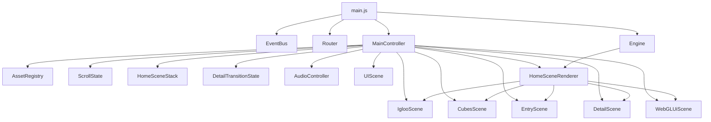
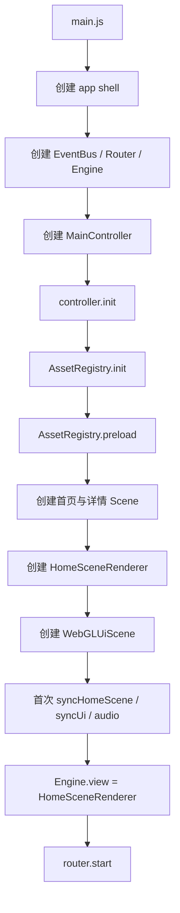
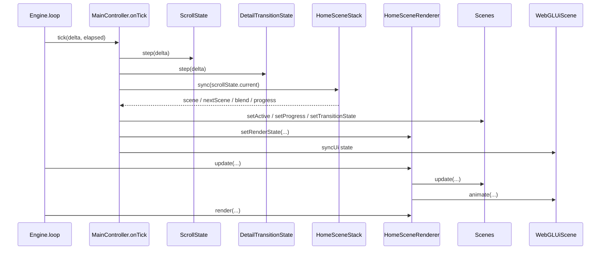
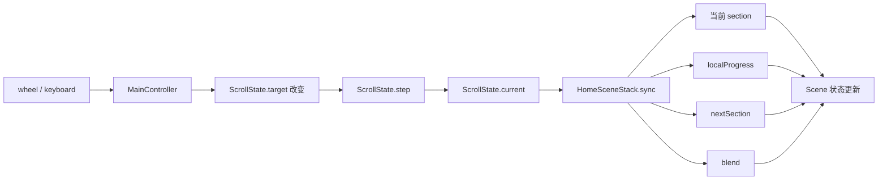
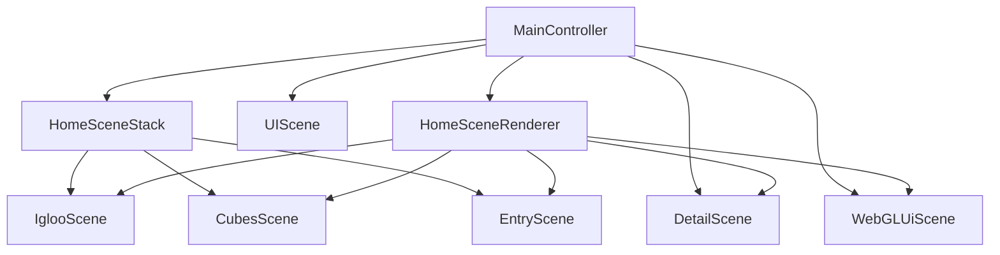
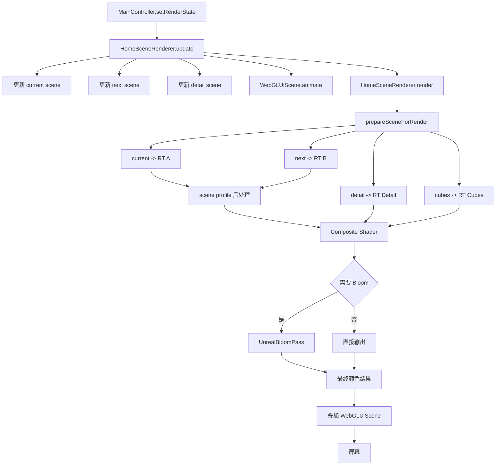
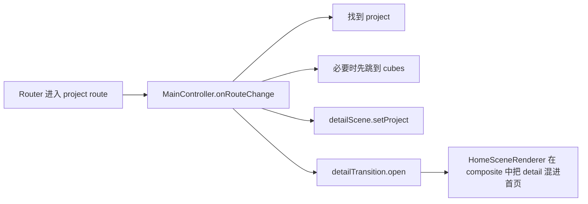
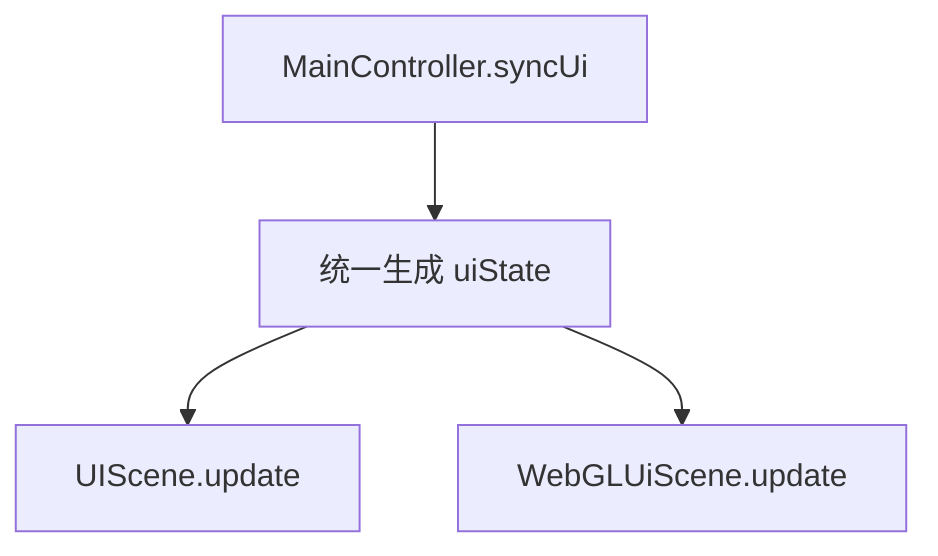

# 运行时心智模型

## 1. 文档目的

这份文档不是再重复一遍源码注释，而是想回答一个更基础的问题：

如果把 `igloo-rebuild` 当成一个整体，它到底是怎样运转起来的？

这份文档重点解决：

- 应该把这个工程理解成什么
- 启动时都创建了哪些核心对象
- 每一帧是谁在推进状态，谁在真正绘图
- 首页滚动、section 切换、detail overlay 为什么能共存在同一套运行时里
- `Engine`、`MainController`、`ScrollState`、`HomeSceneStack`、`HomeSceneRenderer` 分别扮演什么角色

如果你已经看过：

- [01-system-overview.md](./01-system-overview.md)
- [02-runtime-flow.md](./02-runtime-flow.md)
- [09-render-pipeline.md](./09-render-pipeline.md)

那么本文可以把它们串成一张更容易记住的“总图”。

## 2. 一句话理解

这个工程不要先理解成“一个网站”，而要先理解成：

一套由 `MainController` 编排状态、由 `HomeSceneRenderer` 合成多个 Three.js scene 的运行时系统。

更口语一点说：

- `Engine` 负责让机器一直转
- `MainController` 负责决定现在该演什么
- `ScrollState` 负责推进首页滚动状态
- `HomeSceneStack` 负责把滚动解释成 section/progress/blend
- 各个 scene 负责各自的视觉内容
- `HomeSceneRenderer` 负责把这些 scene 合成成最终画面

## 3. 顶层结构图



## 4. 你可以把它类比成什么

如果用影视分工类比，这套系统会比较好理解：

| 角色 | 对应模块 | 职责 |
| --- | --- | --- |
| 导演 | `MainController` | 决定这一刻应该演哪段、切到哪里、UI 和音频怎么配合 |
| 摄影棚 | `HomeSceneRenderer` | 负责把多个场景素材组合成最终镜头 |
| 舞台调度 | `HomeSceneStack` | 决定当前处在首页哪一段、下一段是谁、切场混多少 |
| 镜头推进器 | `ScrollState` | 维护首页滚动的当前位置、目标位置和吸附动画 |
| 演员 | `IglooScene` / `CubesScene` / `EntryScene` / `DetailScene` | 各自负责自己的对象树、材质、动画和视觉表现 |
| 片场循环系统 | `Engine` | 每帧固定调用 update 和 render，让整套系统一直运转 |

这个类比很重要，因为它说明：

- scene 不是系统的大脑
- renderer 不是业务编排器
- controller 也不是直接绘图的人

每一层都只做自己的事。

## 5. 启动链路图



### 5.1 启动时发生了什么

启动阶段真正完成了 4 件事：

1. 创建基础设施
   - `EventBus`
   - `Router`
   - `Engine`
2. 创建顶层总控制器 `MainController`
3. 加载资源并实例化各个 scene
4. 把 `Engine.view` 切到 `HomeSceneRenderer`

关键点在最后一步：

首页状态下，`Engine` 并不是直接渲染某个单独 scene，
而是把整个首页交给 `HomeSceneRenderer` 统一合成。

## 6. 常驻每帧调用图



### 6.1 这条调用链真正意味着什么

每一帧的工作分成两大段：

第一段是状态推进：

- `MainController.onTick()`
- `ScrollState.step()`
- `DetailTransitionState.step()`
- `HomeSceneStack.sync()`

第二段是画面产出：

- `HomeSceneRenderer.update()`
- `HomeSceneRenderer.render()`

所以不要把 `onTick()` 理解成“渲染函数”，它更像“准备本帧该怎么演”。

## 7. 首页滚动是怎么工作的

首页不是浏览器真实滚动，而是一条运行时自管的抽象滚动轴。

图如下：



### 7.1 为什么需要 `ScrollState`

因为这套首页不是让浏览器自然滚出三屏内容，而是：

- 输入先改变一个抽象目标值 `target`
- 每帧再由 `current` 逐渐追向 `target`
- scene 再根据 `current` 得到的 progress 做动画

这样做的好处是：

- 可以做平滑阻尼滚动
- 可以做自动居中吸附
- 可以做 wrap 循环滚动
- 可以让滚动和 3D 动画保持在同一套运行时语义里

### 7.2 为什么还需要 `HomeSceneStack`

`ScrollState` 只知道“当前位置是多少”，
但它不知道“这个位置意味着现在应该显示哪个 scene”。

这部分翻译工作由 `HomeSceneStack` 做：

- 把 scroll 映射成 section
- 算当前 section 的局部进度
- 算下一段 section 是否开始进入
- 算 section 之间的混合值 `blend`

所以：

- `ScrollState` 负责数值推进
- `HomeSceneStack` 负责语义解释

## 8. Scene 在系统中的位置

首页 3 个主 scene：

- `IglooScene`
- `CubesScene`
- `EntryScene`

详情 overlay：

- `DetailScene`

UI：

- `UIScene`
- `WebGLUiScene`

它们的关系不是并列平铺，而是分层的：



### 8.1 Scene 负责什么

scene 负责自己的内部表现：

- 相机
- 对象树
- 材质
- shader
- 粒子
- 动画
- pointer 响应

### 8.2 Scene 不负责什么

scene 一般不负责：

- 整个首页现在在哪一段
- 路由切换
- detail 开合节奏
- 整站 HUD 状态
- 最终如何与别的 scene 合成

这些都在运行时层解决。

## 9. 渲染管线总图



### 9.1 这条图最值得记住的点

首页不是：

`renderer.render(scene, camera)`

而是：

1. 多个 scene 分别离屏渲染
2. 根据 profile 做后处理
3. 再做 fullscreen 合成
4. 必要时再加 bloom
5. 最后叠加 WebGL HUD

这也是为什么本项目会比普通 Three.js demo 更像一个小型 render graph。

## 10. detail 为什么不是独立页面

这是很多人第一次看代码时最容易误解的地方。

路由虽然切到了 `/portfolio/:project`，但 detail 并不是：

- 销毁首页 scene
- 新建一个独立 detail 页面
- 单独 render detail

它实际是：



也就是说：

- 首页 scene 仍然活着
- `DetailScene` 被当成 overlay scene 混进去
- `CubesScene` 还会给 detail 提供 handoff anchor

所以 detail 更像“首页之上的一层接管”，而不是“新页面重开一套世界”。

## 11. UI 为什么有两套

这套工程同时保留：

- `UIScene`
  - DOM 实现
  - 偏功能和 fallback
- `WebGLUiScene`
  - WebGL 实现
  - 偏视觉还原

图如下：



这不是重复实现，而是迁移策略：

- DOM HUD 保证功能完整
- WebGL HUD 负责更像原版的视觉表现

所以你以后看 UI 相关问题时，要先分清它属于：

- 交互/可用性问题
- 还是视觉 overlay 问题

## 12. 最容易混淆的职责边界

### 12.1 `Engine` vs `MainController`

`Engine`

- 有 renderer
- 有 clock
- 管每帧 update/render
- 不懂业务

`MainController`

- 懂 route
- 懂首页 section
- 懂 detail 过渡
- 懂 UI 和 audio 状态
- 不直接画图

### 12.2 `HomeSceneStack` vs `HomeSceneRenderer`

`HomeSceneStack`

- 解释 scroll
- 决定 current / next / blend
- 回写 scene progress

`HomeSceneRenderer`

- 更新当前参与渲染的 scene
- 组织 render target
- 做后处理和合成
- 输出最终画面

一句话：

- `HomeSceneStack` 决定“演什么”
- `HomeSceneRenderer` 决定“怎么拍出来”

### 12.3 `UIScene` vs `WebGLUiScene`

`UIScene`

- 功能层
- 命中层
- fallback

`WebGLUiScene`

- 视觉层
- overlay
- 渲染管线最后叠加

## 13. 建议阅读顺序

如果你现在还在建立心智模型，推荐这样读：

1. [src/main.js](../src/main.js)
   看对象怎么创建起来
2. [src/runtime/MainController.js](../src/runtime/MainController.js)
   看状态如何统一编排
3. [src/runtime/ScrollState.js](../src/runtime/ScrollState.js)
   看首页滚动状态怎么推进
4. [src/runtime/HomeSceneStack.js](../src/runtime/HomeSceneStack.js)
   看滚动如何变成 section/progress/blend
5. [src/runtime/HomeSceneRenderer.js](../src/runtime/HomeSceneRenderer.js)
   看多个 scene 怎么变成最终画面
6. 再分别进入各个具体 scene

如果你已经开始调画面细节，则推荐接着读：

- [09-render-pipeline.md](./09-render-pipeline.md)

## 14. 排查问题时先问自己什么

如果你看到一个异常，先问自己它属于哪一层：

### 14.1 输入没反应

优先看：

- `MainController`
- `ScrollState`
- pointer / keyboard / wheel 绑定

### 14.2 section 进度不对

优先看：

- `HomeSceneStack`
- `ScrollState.current`
- `blend` 与 `localProgress`

### 14.3 画面过渡不对

优先看：

- `HomeSceneRenderer`
- scene profile 后处理
- composite shader

### 14.4 detail 打开不自然

优先看：

- `MainController.onRouteChange`
- `DetailTransitionState`
- `CubesScene` 的 handoff anchor
- `DetailScene`

### 14.5 HUD 表现不对

优先分清：

- 是 `UIScene` 的 DOM 问题
- 还是 `WebGLUiScene` 的 overlay 问题

## 15. 最后一张极简总图

```text
用户输入
  -> MainController
  -> ScrollState / DetailTransitionState
  -> HomeSceneStack
  -> scene progress / transition state
  -> HomeSceneRenderer
  -> RenderTargets / Post / Composite / Bloom / WebGL HUD
  -> 屏幕
```

## 16. 一句话总结

这套工程的核心不是“页面切换”，而是：

一套由 `MainController` 驱动状态、由 `HomeSceneRenderer` 统一合成多个 scene 的实时运行时系统。
